# Website – Supplementary Admin Guide
## Table of Contents
1. [Page types](#page-types)
   
    1.1 [Home page](#home-page)
    
    1.2 [About page](#about-page)
    
    1.3 [Content page](#content-page)
    
    1.4 [Service finder page](#service-finder-page)
    
    1.5 [Service page](#service-page)
    
    1.6 [Blog index page](#blog-index-page)
    
    1.7 [Blog category page](#blog-category-page)
    
    1.8 [Post page](#post-page)

2. [Page Building Sections & Blocks](#page-building-sections--blocks)
    
    2.1 [Featured blog post section]()
    
    2.2 [Columns section](#columns-section-home-page-content-pages)
    
    2.3 [Social media posts section](#social-media-posts-section-home-page-blog-index-page)
    
    2.4 [Latest Blog Posts Section](#latest-blog-posts-section-home-page)
   
    2.5 [Time Line Section](#time-line-section-about-page)
    
    2.6 [Faq Section](#faq-section-about-page)
   
    2.7 [Key Figures And Testimonials Section](#key-figures-and-testimonials-section-about-page)
    
    2.8 [Details Section](#details-section-service-pages-post-pages)

3. [Editing Services & Service Locations](#editing-services--service-locations)
    
    3.1 [Service Types](#service-types)
    
    3.2 [Service Locations](#service-locations)

4. [Editing Global Settings – Scripts & Footer](#editing-global-settings)
   
    4.1 [Scripts](#scripts)
    
    4.2 [Footer](#footer)

5. [Moya App](#moya-app)
   
6. [Adding Admin Users](#adding-admin-users)

   6.1 [Google Login](#google-login)
   
   6.2 [Enabling Google Login for Admin Users](#enabling-google-login-for-admin-users)
    
## Page types
Your website consists of a variety of page types. Each page type has different properties. 
All page types have two edit tabs: the **Content tab** and the **Promote tab**.  
The main content of each page is located under the Content tab which is organized into sections. 
The most common sections under **Content tab** are the **Header Section** and the **Body Section**.  
Under the **Promote tab** you can edit the page’s **SEO details** such as the preview title, the meta description and the image of the page for when it appears in search engine results or when it’s posted on social media. Below you can read a description for each page type.

### Home page
This is a unique page type therefore you can only have one **Home page** in the hierarchy of your pages. 
This page type is the root of the whole website and it’s located at the top level of the pages’ hierarchy.  
Under the **Content tab**, in the **Header Section** of the home page you can manage the:
- header title
- header subtitle
- header background color
- header background image
- header left side image (graphics)
- header right side image (graphics) 
- social media links.  

Under the **Content tab**, in the **Body Section** you can manage the main content of the home page using four **Building Blocks Sections**:
- Featured blog post section
- Columns section (The Columns Section has four building blocks: Paragraph; Button; Faq; Grid)
- Social media posts section
- Latest Blog Posts section. 

You can mix & match these sections to create the homepage structure you prefer. (refer to the Page Building Sections & Blocks section for more info)
### About page
This is a unique page type therefore you can only have one **About page** in the hierarchy of your pages.   
Under the Content tab, in the Header Section of the About page you can manage the:
- header title
- header subtitle
- header background image
- header image (graphics).  

Under the Content tab, in the Body Section you can manage the main content of the About page using three Building Blocks Sections:
- Time Line Section
- Faq Section
- Key Figures And Testimonials Section. 

You can mix & match these sections to create the About Us page structure you prefer. (refer to the Page Building Sections & Blocks section for more info)
### Content page
This is a Generic Content page and you can create multiple Content pages in your website’s hierarchy.  
Under the Content tab, in the Header Section of a Content page you can manage the:
- header title
- header subtitle
- header background image
- header image (graphics).  

Under the Content tab, in the Body Section you can manage the main content of the about page using the Columns Section. 
The Columns Section has four building blocks:
- Paragraph
- Button
- Faq
- Grid. 

You can mix & match these blocks to create the page structure you prefer. (refer to the Page Building Sections & Blocks section for more info)
### Services finder page
This is a unique page type therefore you can only have one Services finder page in the hierarchy of your pages. 
Under the Content tab, in the Header Section of a Service finder page you can manage the:
- header title,
- header subtitle,
- header youtube video id
- header youtube video poster image. 

This page type has no **Body Section**. 
The main content of the page is automatically drawn from the data you have entered under the Services option of the Sidebar and the Service pages you created (i.e. Service types, Service locations, Services).(refer to the Editing Services and Service Locations section & the Service page section)
### Service page
For each Service, you need to create a Service page. You can only create a Service page under the Service finder page.  
Service pages have a Details section where you can fill in the details of the new Service. Under the **Details section** you can also find the **Additional items section** where you can add additional information or useful links. This page type lacks the **Header** and the **Body sections**. 
### Blog index page
This is a unique page type therefore you can only have one **Blog index page** in the hierarchy of your pages.  
This page type has the property to automatically display all its child-pages as filters (blog category pages) and articles (post pages). Therefore, every time you publish a new Blog category page or a new Post page it will automatically appear in your Blog.  
Under the Content tab you can manage the **Featured Post** that appears in your Blog.  
Under the Body section of the Content tab you can create a **Social Media Posts Section** to add any social media posts you wish. (refer to the Social Media Posts section). 
Under the Posts Share/Like Buttons section of the Content tab you can tick the checkboxes in case you wish for the social media share buttons to appear in your articles (post pages) or if you wish for the Like button to appear in your articles. 

### Blog category page
This page type has no content, and **Blog category pages** can only be created under the Blog index page.  
You should create a new Blog category page when you wish to add a new Blog category, so that you can categorize your articles (post pages) into a new category in your blog.  
Creating a new Blog category page under the Blog index page will create a new category filter in the Blogs page (in the example below you can view 2 category filters: Relationships; Sex).  

### Post page
To publish an article in your Blog, you need to create a Post page under the Blog category page it belongs. Post pages can only be created under the Blog category pages. 
Under the Content tab you can fill in the article’s details such as the publication date, the article’s main image, the preview text, the main text.
## Page Building Sections & Blocks

Under the Body Section of the different page types you can create the sections & blocks described in the following sections of this guide:
### Featured blog post section (Home page)
Using the Featured blog post section you can choose a featured article (post page).
This section will display a preview title and image of the article (post page) you will select.  

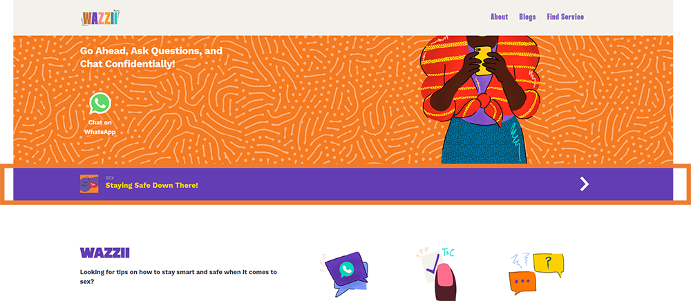

### Columns section (Home page; Content pages)
The Columns section has four building blocks:
- Paragraph.
- Button.
- Faq.
- Grid. 

You can mix & match these blocks to create the page structure you prefer.  

You can create multiple columns with different block combinations. When creating a new column, you need to select the column Width (100%, 60%, 50%, 40%).
- **Paragraph block**: You can create this block to add text. You can insert links, documents, image and embed videos to you paragraph. 
- **Button block**: You can create this block to add a button to your column. For each button you need to select the devices on which the button will be visible (Desktop, Mobile or both) 
- **Faq block**: You can create this block for questions and answers. 
- **Grid block**: This block organizes the images in the form of “Tiles” with some supplementary text for each tile.

Example: In the example below you can view a Column section with 5 columns (titled as Column 1; Column 2; Column 3; Column 4; Column 5):
- Under the first column there is a 50% Paragraph block (Column 1).
- Under the second column there is another 50% Paragraph block and a Button block (Column 2).
- The third column has a 40% Paragraph block and a Button block (Column 3).
- The forth column has a 60% Grid block with 3 tiles (Column 4).
- The fifth column has a 100% width Faq block with 3 Q&A’s (Column 5).

### Social media posts section (Home page; Blog index page)
To add social media posts on your page you need to create a **Social media posts section**. 
You can then fill in the title of the section, a subtitle, a footnote and the logos and links of your social media platforms. 
You can then start adding posts to the section. Select an image for each post and insert the Youtube video id into the corresponding field. 
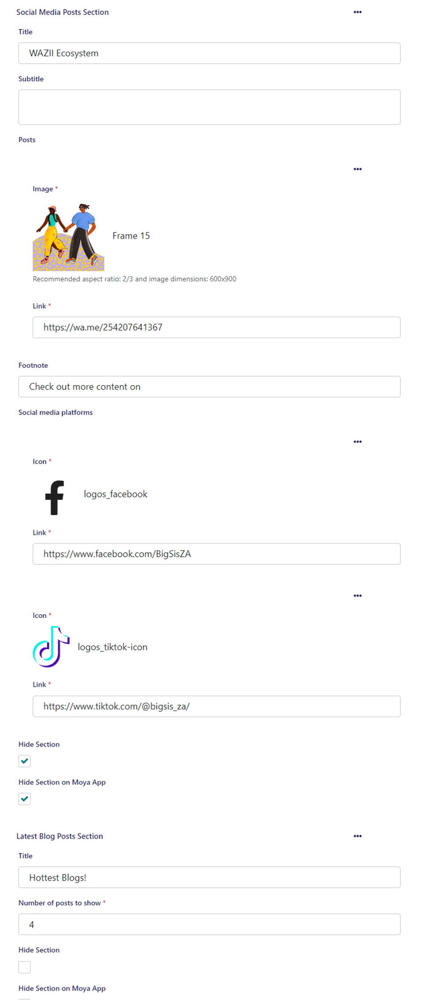

### Latest Blog Posts Section (Home page)
If you need a section with your latest articles, you need to create a **Latest blog posts section**. 
You just need to fill in the title of your new section and select how many of the latest articles (post pages) will be displayed in the section.

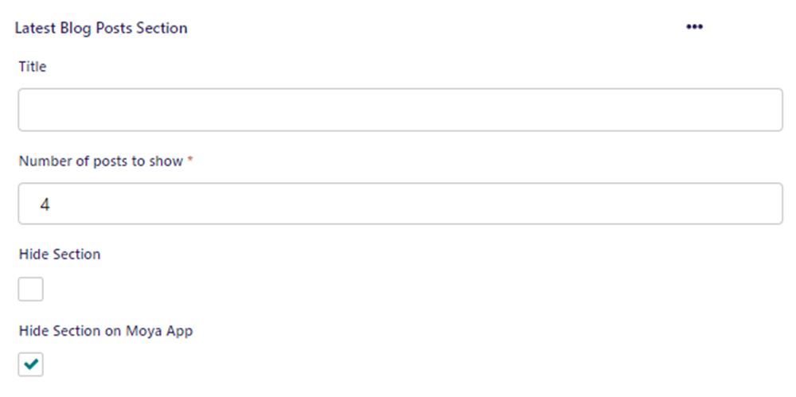

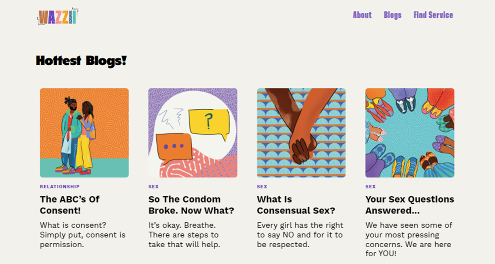
### Time Line Section (About page)
The **Time Line section** is available in the About page type. You can create this section to display a timeline. 
You just need to fill in the Timeline’s title and then start adding your events (items). 

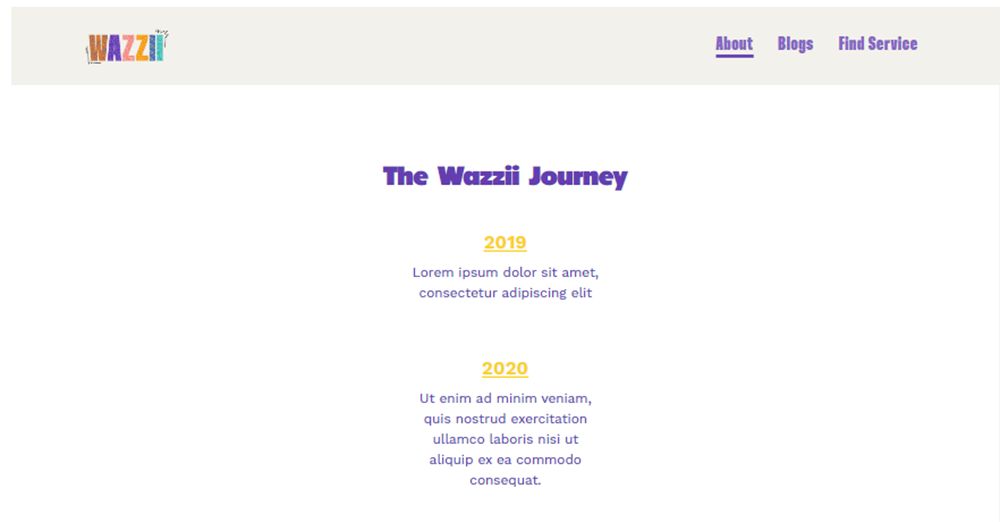
### Faq Section (About page)
Create a **Faq section** for questions and answers. You just need to fill in the section’s title and start adding items (questions-answers).

### Key Figures And Testimonials Section (About page)
Create a **Key figures and testimonials section** to mention any key figures and to display testimonials 
You just need to fill in the section’s title and start adding Key figures and Testimonials. 
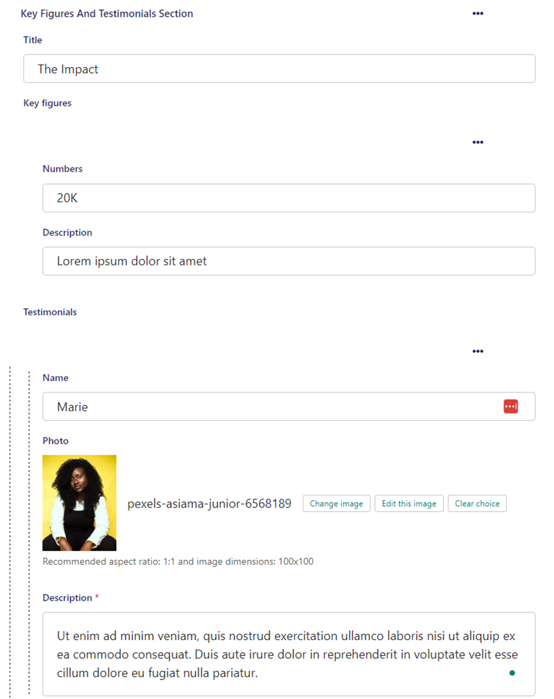

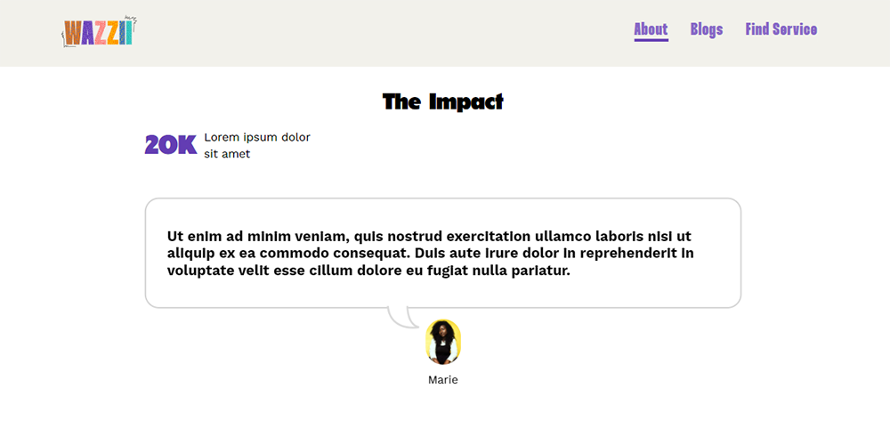
### Details Section (Service pages; Post pages)
Service pages and Post page have no building sections or blocks. You just need to fill in the fields under the Content tab.
## Editing Services & Service Locations
### Service Types
Clicking on the option **Services** will expand your **Sidebar**. From the expanded **Sidebar** you can select the option **Service Types** to modify any existing service types or to add new ones. 
Hover over a service’s name, then click edit to edit the **Service Type**. To add a new **Service Type** click on the **Add Service Type** button. 

Note that the Service Types created here will appear in the filters on the Services Finder page of the website so that the users can select them. 

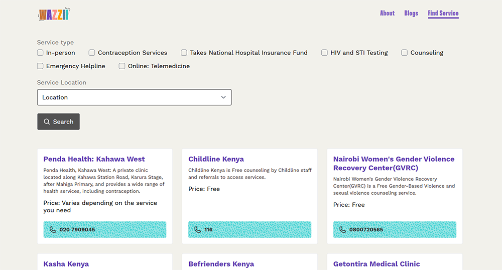
### Service Locations
Clicking on the option **Services** will expand your **Sidebar**. From the expanded **Sidebar** you can select the option **Service Locations** to modify any existing locations or to add new ones. 
Hover over a location’s name, then click edit to edit the Service Location. To add a new Service Location click on the Add Service Location button.

Note that the Service Locations created here will appear in the dropdown field on the Services Finder page of the website so that the users can select them.
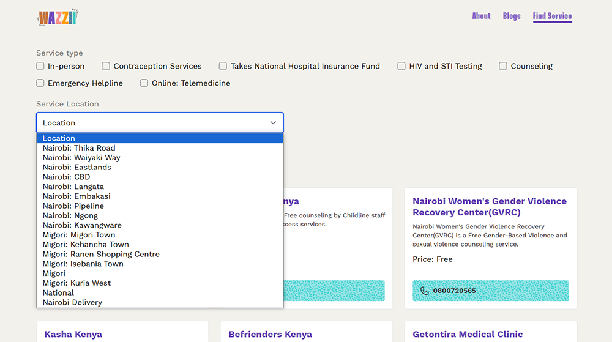

## Editing Global Settings
Clicking on the option Settings will expand your **Sidebar**. From the expanded Sidebar you can select the option Global Settings. 
Through the Global Settings you can manage your Scripts e.g. Google Analytics scripts and your Footer.

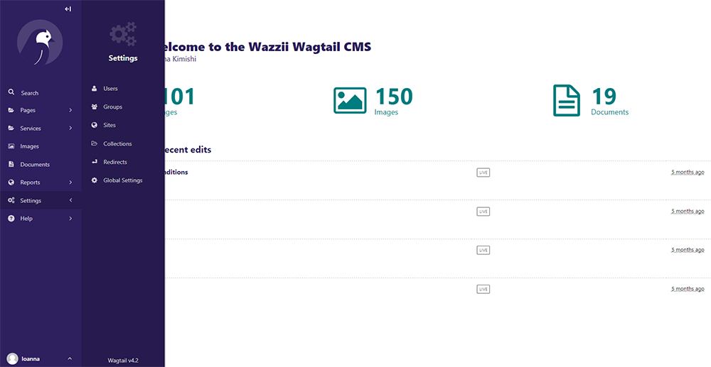
### Scripts
Under the Scripts tab you can edit any existing scripts, or you can click on the **Add script** button to add a new script. 
You can position each script either in the **Head** or in the **Body** of the pages by selecting one of the two options available in the dropdown list. 
To delete a script, you can hover over the Script title and click on the delete icon that will appear.      
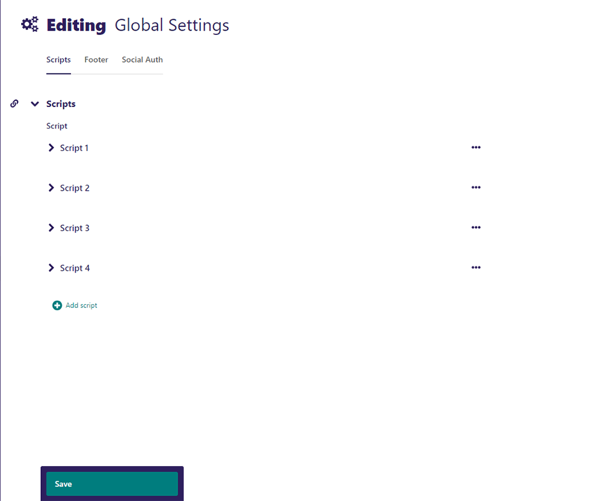
### Footer
Switch to the **Footer** tab to edit the content of your website’s footer such as the text, the email, the footer’s background image and the footer’s sitemap.
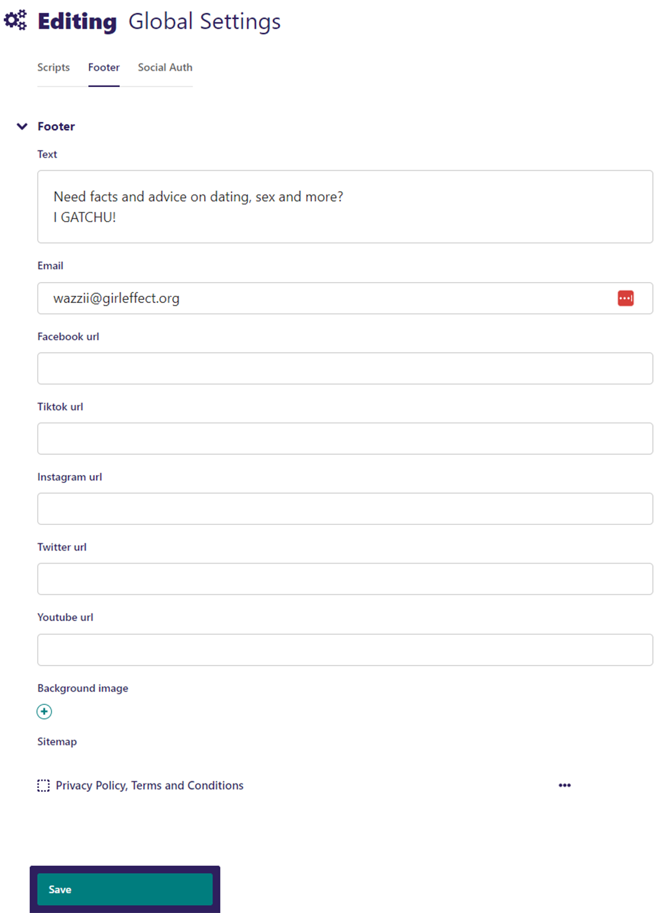

## Moya App
### Introduction
The website can recognise the traffic that is coming from the Moya Mobile Application. This is achieved by checking the existense of a URL parameter in the URL of the request (x-binu-did). If this parameter exists, the website serves a different and lighter version of the website. This lighter version:
- does not include complicated Javascript functionality (e.g Sliders)
- removes embdedded iframe videos from certain sections
- removes the Chatbot integration and scripts
- and can also hide specific content as described below 

### Controlling the content
While creating or modifying a page you have the option to show or hide certain sections in the Moya App by checking/unchecking the "Hide Section on Moya App" checkbox, that is available for each section. This feature allows you to customize the content that is being delivered when accessign the website through the Moya Application and simplify the website. 

### Adding Admin Users

Clicking on the option **Settings** will expand your **Sidebar**. From the expanded Sidebar you can select the option **Users**. Through the Users option you can add new Admin Panel Users or edit/remove any existing users. Click **Add a user** and fill in the details of the new user. Once you fill in the details of the new user you can click on the **Roles** button and select the permissions of the new user (for full access administrators you can tick the Administrator checkbox). 

## Google Login
You can use your Google account to login in the Wagtail Administration panel by following this link: <domain>/login/google-oauth2/
In order to set this up, an application on your Google Workspace account needs to be created and the following data need to be added in the Divio Environment variables: 
- SOCIAL_AUTH_GOOGLE_OAUTH2_KEY
- SOCIAL_AUTH_GOOGLE_OAUTH2_SECRET 

## Enabling Google Login for Admin Users
Admin users also have the option to login to the admin panel using their Google Account. To enable Google login for a user, you need to select **Settings** and then **Global Settings** from your menu. Click on the **Social Auth tab**, add the email address of the user you wish to enable Google login for and click **Save**. Make sure that the email address you added here is the same email address you entered while creating the specific admin user.  

Once you enable Google login you can login using your Google credentials and click on the **Google** button to login.     

